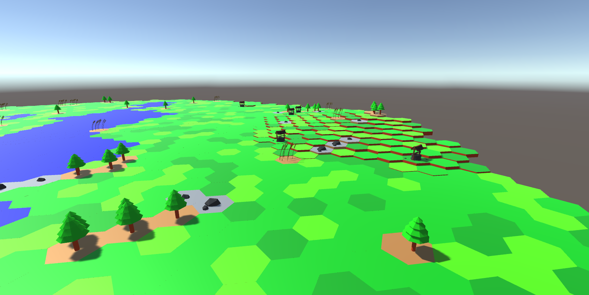

# HexTexMex

This project is a playground for a round based strategy game in Unity3D.

**Planned is:**
* Round based virtual board/strategy game
* Resource gathering
* Base building
* Multiplayer
* Fighting

**Current state is:**

First implementation of a POC random map generation with water, forests, (animated) wheat, stone and wells.

#### Screenshots:

**Screenshot 1**

**Screenshot 2**

**Screenshot 3**

**Screenshot 4**
