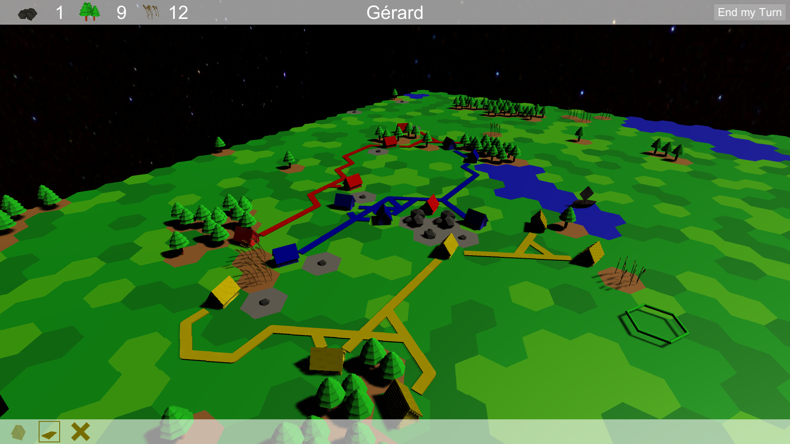
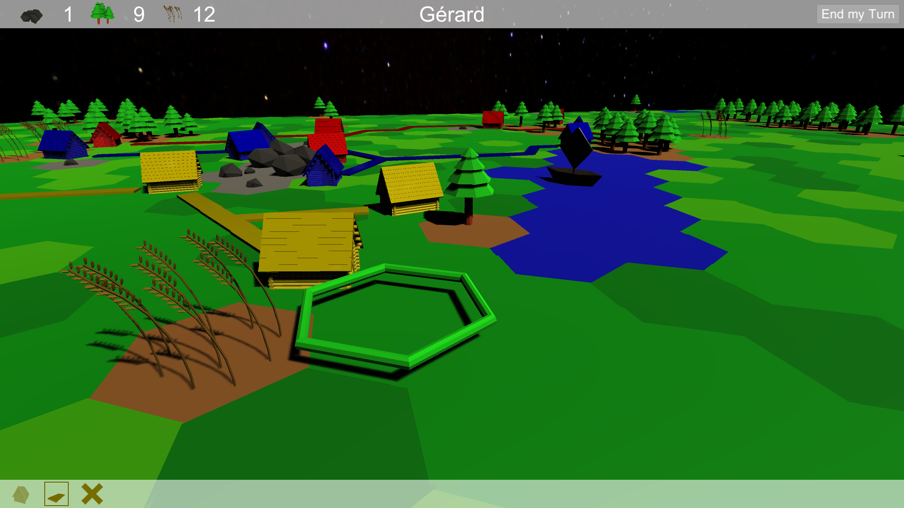
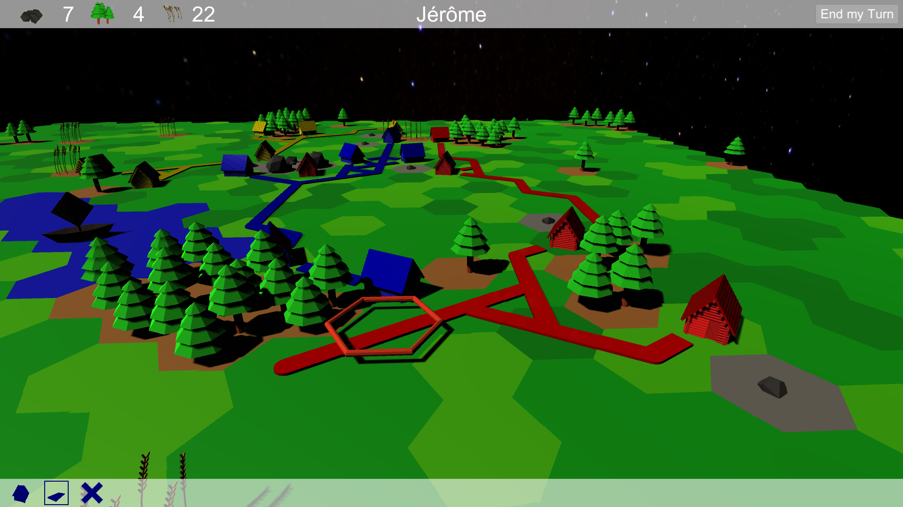
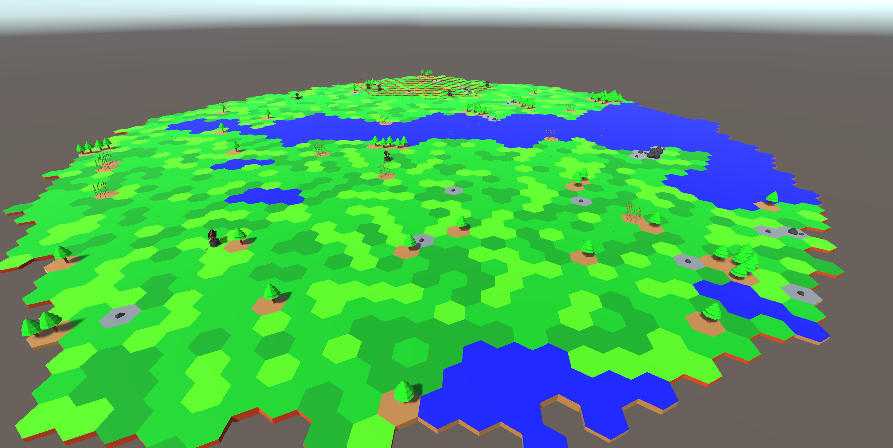
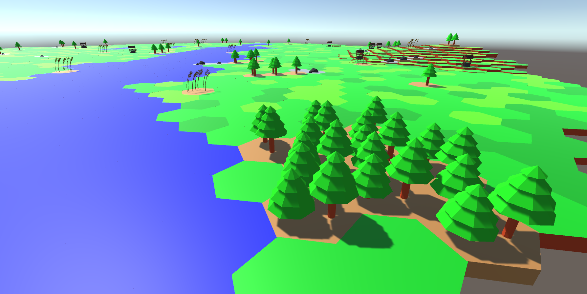
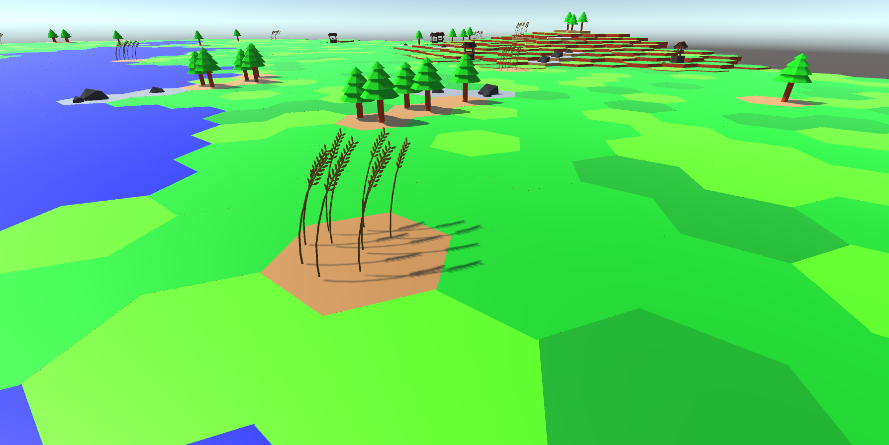

# HexTexMex

This project is a playground for a round based strategy game in Unity3D.

# Try it yourself
https://0x3b29.github.io/HexTexMex/webgl-build/index.html

**Planned is:**

* Fighting
* Network Multiplayer
* Advanced base building
* Winning condition

**Current state is:**

* First implementation of a POC random map generation with water, forests, (animated) wheat and stone.
* Round based virtual board/strategy game
* Resource gathering
* Basic base building
* Basic local Multiplayer

#### Screenshots:

**Current state**

**Screenshot 5**

**Screenshot 6**

**Screenshot 7**

**Old state**

**Screenshot 1**

**Screenshot 2**

**Screenshot 3**

**Screenshot 4**
